<div align="center">


<h1>ResQFlow</h1>
<h3>Floods Demand Faster. Smarter. Decision.</h3>

<p>A geospatial disaster-response command centre that moves emergency teams from fragmented flood information to prioritised, explainable, operational decisions.</p>

<p>
  
  
  
  
</p>

<p>
  
  
  
  
  
  
</p>

<sub><b>Overview</b> &nbsp;·&nbsp; <b>Architecture</b> &nbsp;·&nbsp; <b>Explainability</b> &nbsp;·&nbsp; <b>API</b> &nbsp;·&nbsp; <b>Getting Started</b> &nbsp;·&nbsp; <b>Roadmap</b></sub>

</div>

<br/>

<table align="center">
<tr>
<td align="center" width="20%"><b>6</b><br/><sub>Intelligence Layers</sub></td>
<td align="center" width="20%"><b>100%</b><br/><sub>Explainable Decisions</sub></td>
<td align="center" width="20%"><b>0</b><br/><sub>Black-Box Allocation</sub></td>
<td align="center" width="20%"><b>24h</b><br/><sub>Camp Forecast Horizon</sub></td>
<td align="center" width="20%"><b>5</b><br/><sub>Delivery Phases</sub></td>
</tr>
</table>

<br/>

> **ResQFlow is currently a decision-support prototype.** Resource allocation and camp forecasting use deterministic, explainable heuristics and demo data. They are not trained predictions and should not be treated as a substitute for operational authorisation.

---

## Table of Contents

| | | |
|---|---|---|
| [01 · About](#about) | [08 · Explainability Engine](#explainability-engine) | [15 · Frontend Experience](#frontend-experience) |
| [02 · The Problem](#the-problem) | [09 · Tech Stack](#tech-stack) | [16 · Portfolio, Watchlist & Alerts](#portfolio-watchlist--alerts) |
| [03 · Product Philosophy](#product-philosophy) | [10 · Data Provider Architecture](#data-provider-architecture) | [17 · Project Structure](#project-structure) |
| [04 · Core Differentiator](#core-differentiator) | [11 · Database Schema](#database-schema) | [18 · Getting Started](#getting-started) |
| [05 · System Workflow](#system-workflow) | [12 · API Reference](#api-reference) | [19 · Roadmap](#roadmap) |
| [06 · Multi-Agent Research Pipeline](#multi-agent-research-pipeline) | [13 · Authentication & Authorization](#authentication--authorization) | [20 · Engineering Principles](#engineering-principles) |
| [07 · Evidence Layer & Validation](#evidence-layer--validation) | [14 · Safe Failure Architecture](#safe-failure-architecture) | |

---

## About

ResQFlow is built around one simple idea:

> **During a flood, knowing what is happening is not enough. The system must help determine what needs attention first and where limited resources should go.**

The platform acts as an operational decision layer between incoming disaster information and response teams, combining a modern command-centre frontend, geospatial intelligence, deterministic decision engines, offline emergency capabilities, hydrological modelling, and a resilient backend architecture.

**Core capabilities**

| Category | Capabilities |
|---|---|
| **Triage & Allocation** | SOS request triage, explainable rescue-resource allocation, resource capability & availability tracking |
| **Relief Operations** | Relief-camp capacity monitoring, camp demand forecasting, food/water stock monitoring, medical-load assessment |
| **Flood Intelligence** | Flood-risk and inundation visualization, hydrological modelling, flood-depth estimation, GeoJSON/GeoTIFF outputs |
| **Field & Resilience** | Field-feedback capture, offline emergency navigation, offline safehouse lookup, CAP 1.2 alert generation, degraded-network operation |

The main command centre brings these capabilities together into a unified operational view.

---

## The Problem

Flood response is fundamentally a **time + information + resource allocation problem**. Emergency teams face many SOS requests arriving simultaneously, limited rescue vehicles and boats, incomplete information about available resources, changing flood conditions, constrained relief-camp capacity, limited food and water, medical-resource bottlenecks, unreliable connectivity, and geographically distributed response teams.

The challenge is therefore not simply *"Will this area flood?"* — it is:

> **"Who needs help first, what resources are available, where should they go, and which relief locations are likely to become overloaded?"**

### The Response Gap vs. ResQFlow's Approach

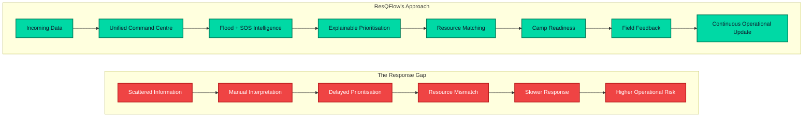

---

## Product Philosophy

ResQFlow follows five product principles.

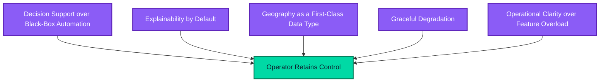

**1. Decision support over black-box automation.** The system recommends actions, but the controller remains in control. Every allocation recommendation exposes human-readable reasons so an operator can validate, override, or reject it.

**2. Explainability by default.** A recommendation without context is difficult to trust during an emergency. ResQFlow exposes the factors behind resource-ranking and camp-risk decisions.

**3. Geography is a first-class data type.** Flood response is inherently spatial. SOS requests, rescue resources, camps and flood zones are represented geographically and processed using PostGIS and geospatial tooling.

**4. Failure should degrade gracefully.** Emergency software cannot assume perfect connectivity. When the backend is unavailable, the frontend continues using typed demo fixtures, and the dedicated offline SOS subsystem can operate without network connectivity.

**5. Operational clarity over feature overload.** The interface is designed around the responder's questions — what is happening, who needs help, what is closest, what resource should be assigned, which camp is under pressure, where is flooding likely to spread, what should happen next.

---

## Core Differentiator

Most disaster platforms tend to focus on one layer — prediction, mapping, incident management, or resource tracking. ResQFlow connects these layers into one operational loop.

### The ResQFlow Decision Stack

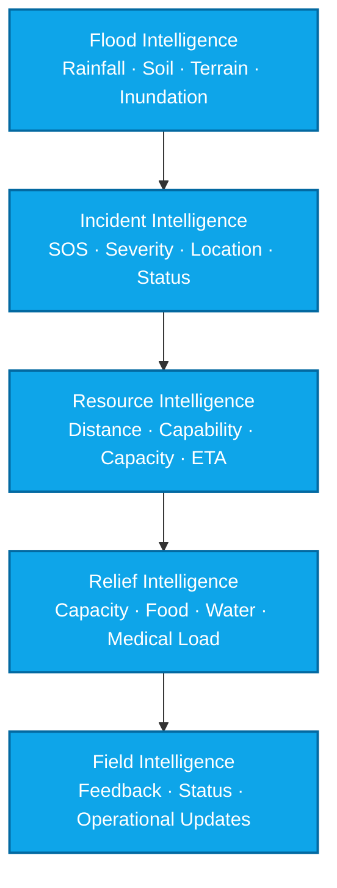

The differentiator is not a single model. It is the **integration of geospatial intelligence, explainable decision logic, emergency workflows and resilient operation into one response system**.

---

## System Workflow

### End-to-End Operational Flow


### Runtime Architecture

ResQFlow uses a three-tier architecture. The browser never receives the Django/database credentials — the Next.js catch-all route forwards requests to Django through the server-only `DJANGO_API_URL`.


---

## Multi-Agent Research Pipeline

> **Current status: Architecture direction / not implemented in the supplied prototype.**

A future ResQFlow intelligence layer can evolve the deterministic decision engines into specialised, cooperating agents — remaining **human-supervised**, especially for high-impact emergency decisions.

### Proposed Agent Architecture

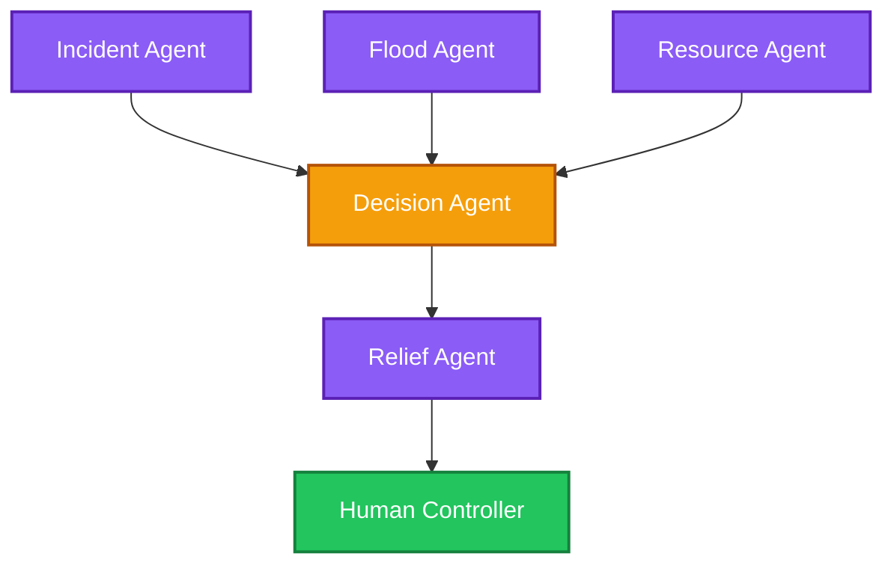

| Agent | Proposed Responsibility |
|---|---|
| **Flood Intelligence Agent** | Interpret rainfall, terrain and inundation outputs |
| **Incident Agent** | Prioritise incoming SOS requests |
| **Resource Agent** | Identify available response resources |
| **Relief Agent** | Assess camp readiness and projected demand |
| **Decision Agent** | Synthesise evidence into an operational recommendation |

---

## Evidence Layer & Validation

ResQFlow's current decision layer is intentionally deterministic. Rather than returning an opaque score, the system exposes the full reasoning chain behind every recommendation.

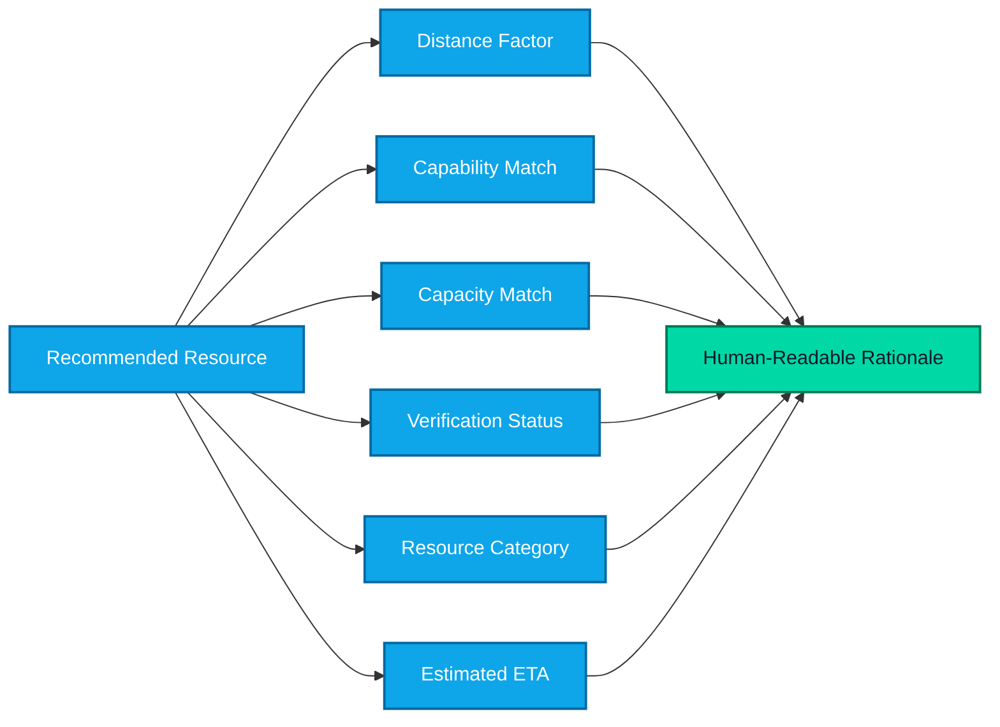

For resource allocation, the recommendation engine considers Haversine distance, livestock capability, medical capability, resource capacity versus party size, verification status, official versus civilian category, and estimated ETA based on resource type. Each recommendation contains the reasons behind its score so a controller can confirm or override it.

Camp forecasts similarly expose projected arrivals, food consumption, water consumption, projected occupancy, people-per-medic load, resulting risk level, and recommended actions.

---

## Explainability Engine

The explainability layer is one of the central design principles of ResQFlow.

### Resource Recommendation

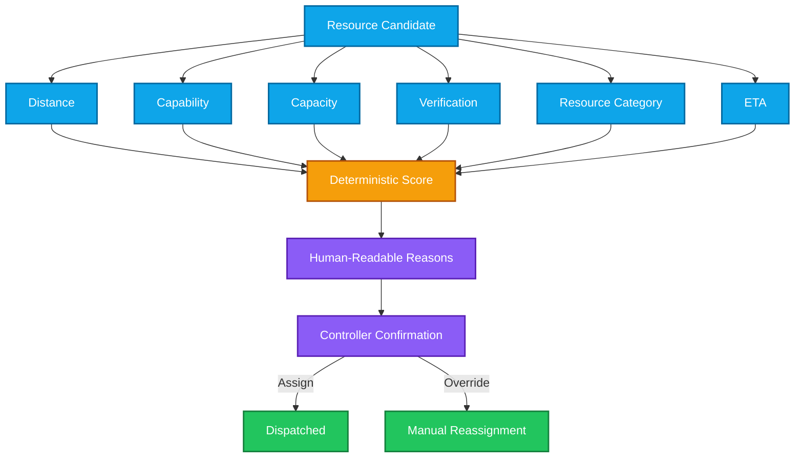

### Camp Risk

Camp demand is projected across **6, 12, and 24 hours**. The system evaluates projected occupancy, food/water stock and medical load and assigns a severity level with reasons and recommended actions.

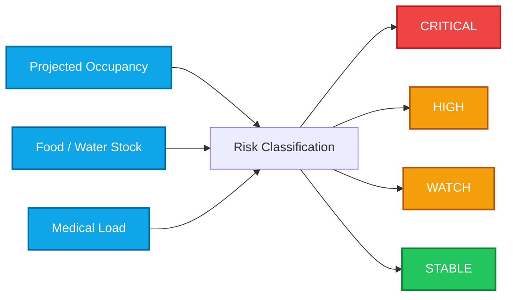

---

## Tech Stack

<table>
<tr>
<td valign="top" width="25%">

**Frontend**

<br/>
<br/>
<br/>
<br/>
<br/>
<br/>


</td>
<td valign="top" width="25%">

**State & Forms**

<br/>
<br/>
<br/>


</td>
<td valign="top" width="25%">

**Backend & Data**

<br/>
<br/>
<br/>
<br/>
<br/>


</td>
<td valign="top" width="25%">

**Hydrology & Deployment**

<br/>
<br/>
<br/>
<br/>
<br/>


</td>
</tr>
</table>

The hydrology engine includes DEM conditioning, SCS-CN runoff, D8 flow routing, TWI, 2D inundation modelling and flood-alert generation.

---

## Data Provider Architecture

ResQFlow uses a resilient multi-source hydrological ingestion strategy.

| Data Domain | Sources |
|---|---|
| **Rainfall** | GPM / IMERG, Open-Meteo fallback |
| **Soil Moisture** | NASA POWER — `GWETROOT`, `GWETTOP` |
| **Terrain** | DEM — sink filling, slope calculation, D8 flow routing, flow accumulation, Topographic Wetness Index |

### Provider Fallback Chain

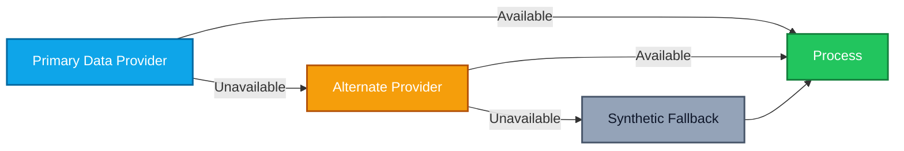

The purpose is resilience: degraded upstream data should not automatically bring down the command centre.

---

## Database Schema

PostgreSQL + PostGIS provides the persistence and spatial layer.

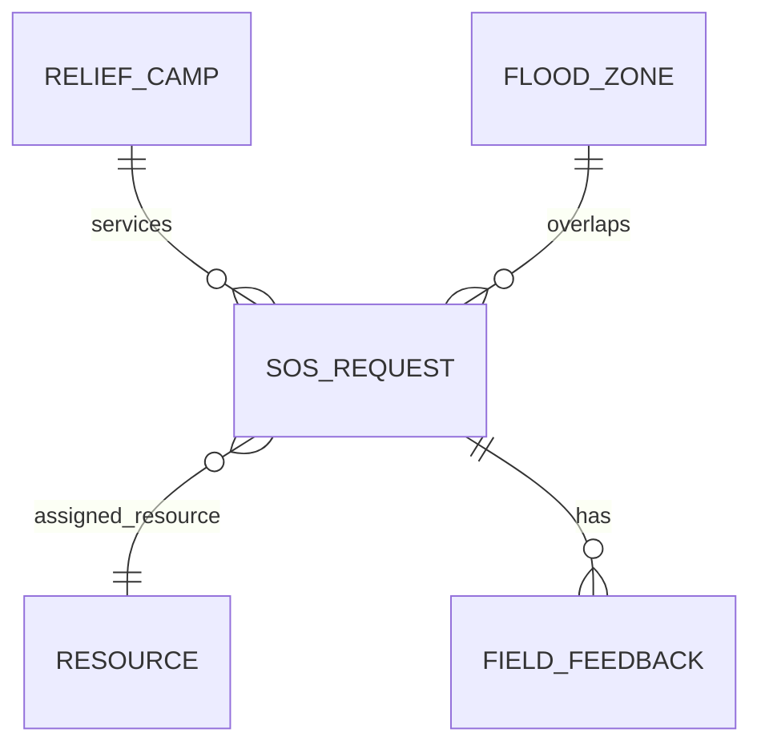

**Spatial model.** Geographic fields use PostGIS Geography with WGS 84 (SRID 4326). The API serialises spatial points as:

```json
{
  "lat": 28.6139,
  "lng": 77.2090
}
```

Spatial indexes are used for geographic fields.

**Relationship behaviour.** `SOSRequest.assigned_resource` is optional — if its linked resource is removed, `assigned_resource` is set to `NULL`. Deleting an SOS request cascades to its feedback records.

---

## API Reference

The Django REST API is rooted at `/api/v1/`. The frontend accesses the same API through `/backend/api/v1/*`.

| Endpoint | Description |
|---|---|
| `GET /api/v1/health/` | Checks PostgreSQL/PostGIS connectivity |
| `GET /api/v1/bootstrap/` | Returns the full dashboard snapshot in a single request |
| `/api/v1/sos/` | CRUD operations for SOS requests |
| `POST /api/v1/sos/{id}/assign/` | Transactionally assigns a rescue resource — returns `409` if unavailable |
| `/api/v1/resources/` | CRUD for rescue resources |
| `/api/v1/camps/` | CRUD for relief camps |
| `/api/v1/flood-zones/` | CRUD for flood zones |
| `/api/v1/feedback/` | CRUD for field feedback — a "Rescued" entry releases the assigned resource |

---

## Authentication & Authorization

> **Current status: Not implemented in the supplied prototype.**

The current prototype does not include authentication or role management. For production, the recommended authorization model separates operational responsibilities:

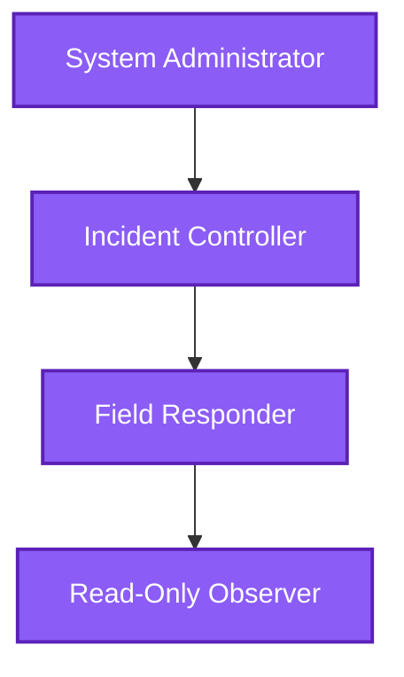

Future production requirements should include authenticated sessions, role-based access control, audit logs, privileged action confirmation, secure API credentials, and emergency override policies.

---

## Safe Failure Architecture

> **When dependencies fail, degrade capability instead of collapsing the entire application.**

### API Failure

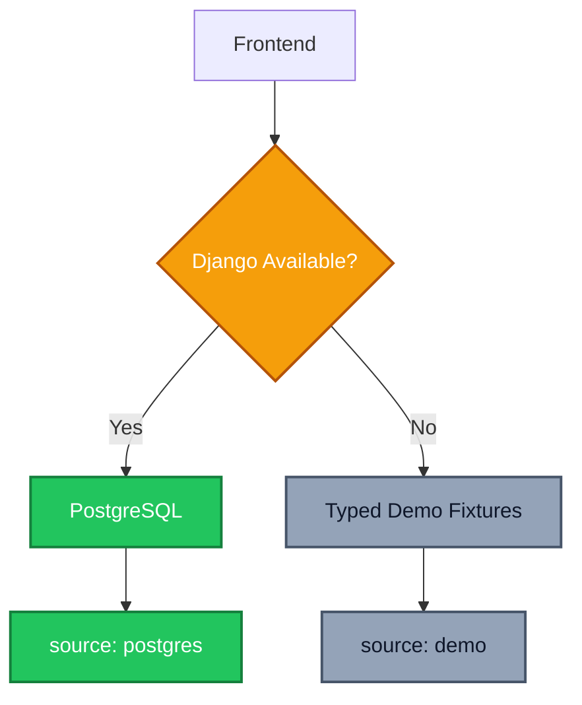

### Offline Emergency Operation

The `/offline-sos` subsystem is designed to continue operating without cellular data, Wi-Fi or upstream cloud connectivity. It uses hardware GNSS, Turf.js spatial calculations, IndexedDB, PWA service workers, cached relief-camp data, and CAP 1.2 XML generation.

---

## Frontend Experience

ResQFlow is organised as an operational command centre rather than a collection of disconnected dashboards.

| Route | Purpose |
|---|---|
| **`/`** — Command Centre | High-level snapshot of SOS requests, available resources, recommendations, system status |
| **`/map`** — Operations Map | Visualises SOS requests, resources, relief camps, flood zones, multiple basemaps |
| **`/sos`** — SOS Operations | Review → Triage → Assign → Dispatch → Update |
| **`/resources`** — Resource Management | Tracks availability, capabilities, resource categories, operational state |
| **`/allocation`** — Allocation | Explainable resource rankings with controller override |
| **`/camps`** — Relief Camps | Tracks capacity, occupancy, supplies, medical load, projected demand |
| **`/field`** — Field Feedback | Records field updates and changes request status |
| **`/analytics`** — Analytics | Prototype response metrics |
| **`/offline`** — Offline | Degraded-network experience |
| **`/demo`** — Demo | Guided prototype walkthrough |

---

## Portfolio, Watchlist & Alerts

> **Current status: Not implemented as a portfolio/watchlist product feature.**

For a future operational intelligence layer, ResQFlow could introduce configurable monitoring views.

| Watchlist | Signal |
|---|---|
| **Incident Watchlist** | High-priority SOS, critical camps, rapidly increasing demand, flooding hotspots, resource shortages |
| **Operational Alerts** | New critical SOS, resource becomes unavailable, camp crosses capacity threshold, food/water stock critical, flood-risk level increases, connectivity degradation |

### Proposed Alert Architecture


These capabilities are roadmap items rather than current implemented functionality.

---

## Project Structure

```text
ResQFlow/
├── app/
│   ├── backend/
│   │   └── [...path]/
│   │       └── route.ts
│   └── ...
│
├── src/
│   ├── routes/
│   ├── components/
│   │   ├── aegis/
│   │   └── ui/
│   ├── hooks/
│   └── lib/
│       └── aegis/
│           ├── api.ts
│           ├── data.ts
│           ├── store.tsx
│           ├── mapStore.ts
│           └── campForecast.ts
│
├── backend/
│   ├── aegis_backend/
│   ├── response/
│   │   └── models/
│   └── hydrology_engine/
│
├── public/
│   └── sw.js
│
├── compose.yaml
├── Dockerfile
└── backend/
    └── Dockerfile
```

| Directory | Responsibility |
|---|---|
| `app/` | Next.js App Router entry points |
| `app/backend/` | Same-origin API proxy |
| `src/routes/` | Screen-level UI |
| `src/components/` | Shared UI and map components |
| `src/lib/aegis/` | Domain state and decision logic |
| `backend/response/` | Django models, serializers and views |
| `backend/hydrology_engine/` | Hydrological intelligence |
| `public/sw.js` | PWA service worker |

---

## Getting Started

**Prerequisites**

```text
Node.js
npm
Docker
Docker Compose
Python environment for backend development
```

**Full Stack**

```bash
docker compose up --build
```

```text
Frontend           http://localhost:3000
Django API         http://localhost:8004/api/v1/
Health Check       http://localhost:8004/api/v1/health/
```

**Frontend Development**

```bash
docker compose up --build -d db backend
npm install
npm run dev
```

The local API proxy defaults to `http://127.0.0.1:8004`.

**Verification**

```bash
npm run typecheck
npm run lint
npm run build
docker compose run --rm backend python manage.py test
```

---

## Roadmap

| Phase | Scope |
|---|---|
| **P1 — Prototype Foundation** | Command centre, SOS management, resource tracking, explainable allocation, relief-camp monitoring, camp demand heuristics, flood-risk map, field feedback, offline SOS subsystem, hydrology engine |
| **P2 — Operational Intelligence** | Real-time event ingestion, live sensor integration, production-calibrated forecasting, advanced flood forecasting, automated alerting, real-time communication layer, background processing workers |
| **P3 — Secure Multi-Agency Platform** | Authentication, role-based authorization, audit trails, multi-agency tenancy, secure emergency workflows, permission-aware data sharing |
| **P4 — Advanced Decision Intelligence** | Multi-agent orchestration, evidence aggregation, confidence-aware recommendations, scenario simulation, what-if resource planning, automated incident summarisation |
| **P5 — National-Scale Deployment** | Large-scale geospatial processing, distributed event architecture, production ML model serving, government alert interoperability, regional command-centre federation, disaster-response analytics at scale |

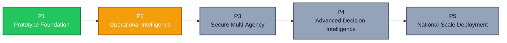

---

## Engineering Principles

| Principle | Over |
|---|---|
| Explainability | Opacity |
| Human-in-the-Loop | Silent Automation |
| Graceful Degradation | Total Collapse |
| Spatial-First Architecture | Location as Metadata |
| Strong Boundaries | Tangled Layers |
| Deterministic Logic | Unnecessary Black Boxes |
| Production-Minded Prototypes | Throwaway Code |
| Fail Safely | Silent Incorrect Action |
| Evidence Before Action | Unsupported Recommendation |
| Built for the Field | Ideal-Condition Assumptions |

**01 — Explainability over opacity.** Every high-impact recommendation should be understandable by the person responsible for acting on it.

**02 — Human-in-the-loop.** Automation should accelerate decisions, not silently replace operational authority.

**03 — Graceful degradation.** External services, databases and networks can fail. The application should degrade safely instead of becoming completely unusable.

**04 — Spatial-first architecture.** Location is not metadata in disaster response — it is core operational state.

**05 — Strong boundaries.** Frontend presentation, client state, API transport, persistence and hydrological processing remain separated.

**06 — Deterministic where possible.** If a rule can be explicit, auditable and reproducible, it should not unnecessarily become a black-box model.

**07 — Production-minded prototypes.** Even prototype components should establish clean interfaces so they can later be replaced with production-grade implementations.

**08 — Fail safely.** Emergency systems should prefer degraded capability over silent incorrect action.

**09 — Evidence before action.** Recommendations should be grounded in observable system state and expose the reasoning behind them.

**10 — Build for the field.** A disaster-response platform must assume unreliable connectivity, incomplete data, rapidly changing conditions, limited resources, and high operational pressure.

---

## ResQFlow at a Glance

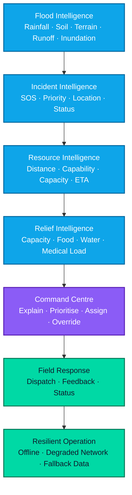

**Don't just predict the flood. Understand the flood. Prioritise the people. Deploy the right resources. Prepare the relief network. And keep the response moving when infrastructure fails.**

---

<div align="center">

## Team

**ResQFlow**

Built for the challenge:
**PS3 — Disaster Response Intelligence Platform for flood prediction, emergency planning and resource allocation.**

<br/>

## Prototype Disclaimer

ResQFlow is a research and operational-prototyping system. The current allocation and camp-forecasting components use deterministic heuristics and demo data rather than fully trained predictive models. The prototype does not currently include authentication, role management, real-time messaging, background workers, external alert ingestion or production-trained ML models.

Production deployment would require domain-specific calibration, validated sensor ingestion, security controls, operational authorisation workflows, reliability testing and deployment hardening.

<div align="center">

<br/>


<h3>ResQFlow — Faster Signals. Smarter Decisions. Better Response.</h3>

</div>
