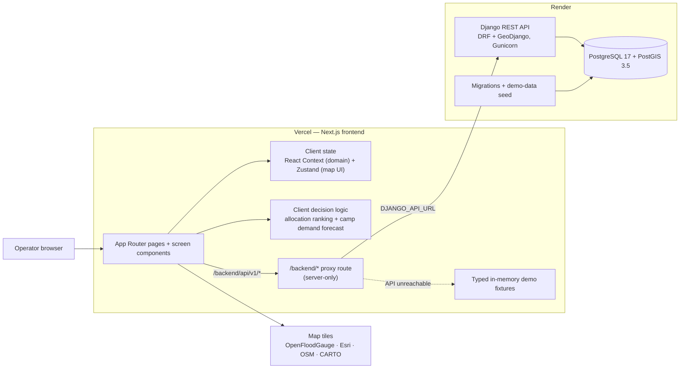
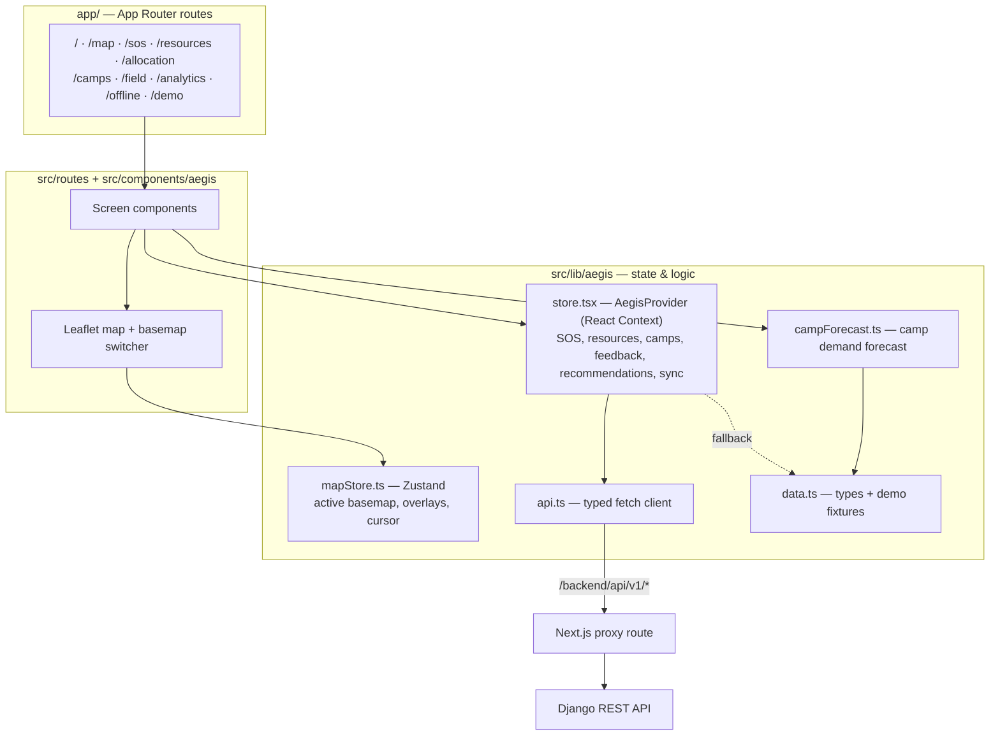
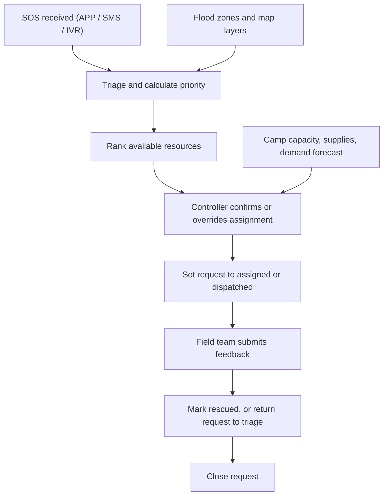
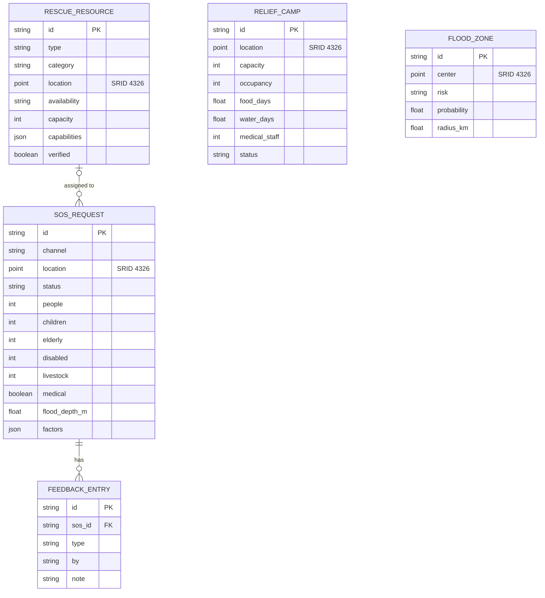

# ResQFlow

ResQFlow is a prototype command centre for coordinating flood-response work:
triaging SOS requests, ranking available rescue resources, tracking relief
camps, forecasting camp demand, recording field feedback, and visualising
flood-risk areas on a live map.

It is a decision-support prototype. Allocation scores and camp forecasts use
deterministic, explainable rules and demo data; they are not trained predictions
or a substitute for operational authorisation.

## System architecture

The runtime has three tiers: a Next.js frontend on Vercel, a Django REST API on
Render, and a PostgreSQL + PostGIS database. The browser only ever talks to its
own origin — a Next.js catch-all route proxies `/backend/*` to Django using the
server-only `DJANGO_API_URL`, so API and database credentials never reach the
client. If the API cannot be reached, the frontend degrades to typed in-memory
demo fixtures and keeps working.



Every browser request goes to the same-origin `/backend/api/v1/*` path. The
route handler at `app/backend/[...path]/route.ts` validates the path, forwards
the method, body, and content type to `DJANGO_API_URL` (default
`http://127.0.0.1:8001` in local development), and returns `503` if Django is
unreachable. On load, the client fetches `/bootstrap` for a full snapshot and
records its data source as `loading`, then `postgres` on success or `demo` on
failure.

## Frontend composition and data flow

App Router entry points under `app/` are thin wrappers that render screen
components from `src/routes/`. Shared UI and map components live in
`src/components/`, and all client data, state, and decision logic live in
`src/lib/aegis/`.



Domain data — SOS requests, resources, camps, feedback, and the derived resource
recommendations — is held in a React Context provider, `AegisProvider`.
Transient map UI (the active basemap, overlay toggles, and cursor coordinates)
is held in a separate Zustand store, `useMapStore`. The typed fetch client in
`api.ts` talks only to the same-origin proxy; the API exposes `camelCase` fields
and represents every PostGIS point as a `lat`/`lng` pair, and the client types
in `data.ts` mirror that shape exactly.

## Decision logic

Both planning aids are deterministic, explainable heuristics that run entirely
in the browser; the backend handles persistence and transactional state changes,
not scoring.

Resource allocation (`recommendFor` in `store.tsx`) ranks available resources
for each open SOS request using a Haversine distance penalty, capability
matching (livestock, medical), capacity versus party size, verification status,
official-versus-civilian category, and an ETA estimate derived from resource
type. Each recommendation carries the human-readable reasons behind its score so
a controller can confirm or override it.

Camp demand forecasting (`buildCampForecasts` in `campForecast.ts`) projects
arrivals over a 6-, 12-, or 24-hour horizon from active SOS demand in the same
district or state, burns down food and water stock against projected occupancy,
checks people-per-medic load, and assigns each camp a
`CRITICAL`/`HIGH`/`WATCH`/`STABLE` risk with the reasons and recommended actions.

## Operational workflow



## Data model



All geographic fields are PostGIS geography points in WGS 84 (`SRID 4326`) with
spatial indexes, serialised to and from `lat`/`lng` pairs by the API.
`SOSRequest.assigned_resource` is optional and becomes `NULL` if the linked
resource is removed (`on_delete=SET_NULL`); deleting an SOS request cascades to
its feedback.

## Stack

| Layer               | Technology                                                             |
| ------------------- | ---------------------------------------------------------------------- |
| Frontend            | Next.js 16 App Router, React 19, TypeScript, Tailwind CSS v4           |
| UI components       | Radix UI primitives with shadcn/ui, lucide-react icons                 |
| Client state        | React Context (domain data) + Zustand (map UI state)                   |
| Forms & validation  | react-hook-form with Zod                                               |
| Charts              | Recharts (analytics)                                                   |
| Maps                | Leaflet with five basemaps (OpenFloodGauge, Esri Topo, Esri Terrain, OSM, CARTO Dark) |
| API                 | Django 5.2, Django REST Framework, GeoDjango, Gunicorn                 |
| Database            | PostgreSQL 17 with PostGIS 3.5                                          |
| Local orchestration | Docker Compose                                                         |
| Production          | Vercel frontend, Render Django API and PostgreSQL                      |

## Main screens

- **Command Centre** (`/`) — snapshot of requests, resources, recommendations,
  and system status.
- **Operations Map** (`/map`) — SOS, resource, camp, and flood-zone layers with
  a basemap switcher.
- **Offline SOS Navigation** (`/offline-sos`) — zero-network GNSS compass, local Turf.js spatial routing, IndexedDB safehouse cache, and OASIS CAP 1.2 XML generation.
- **SOS Requests** (`/sos`) — review, triage, assign, dispatch, and update
  requests.
- **Resources** (`/resources`) — rescue-resource availability and capability
  tracking.
- **Allocation** (`/allocation`) — explainable resource ranking with controller
  override.
- **Relief Camps** (`/camps`) — capacity, supplies, medical load, and demand
  forecasts.
- **Field Feedback** (`/field`) — record field updates and change request status.
- **Analytics** (`/analytics`) — prototype response metrics.
- **Connectivity** (`/offline`) — offline and degraded-network experience.
- **Demo Run** (`/demo`) — guided walkthrough of the prototype.

## Offline Flood SOS & Spatial Navigation Engine

ResQFlow incorporates an autonomous, zero-network emergency evacuation and triage subsystem (`/offline-sos`) designed to function when all cellular data, Wi-Fi, and upstream cloud connectivity are completely offline:

1. **Client-Side Spatial Math (`@turf/turf`)**:
   * Computes great-circle distance vectors and true compass azimuth bearing angles from hardware GNSS coordinates to all pre-cached relief safehouses.
   * Dynamically renders a rotating SVG compass instrument with 8-point cardinal resolution (`N`, `NE`, `E`, `SE`, `S`, `SW`, `W`, `NW`).

2. **Local Storage Cache (`idb` / IndexedDB)**:
   * Replicates central relief camp records (`CAMPS`) into `qflow_emergency_db` on launch.
   * Allows field responders and citizens to query safehouse capacity, occupancy, district, and coordinates completely offline.

3. **OASIS Common Alerting Protocol (CAP v1.2) XML Engine**:
   * Generates standards-compliant OASIS CAP 1.2 XML distress alerts (`src/lib/capGenerator.ts`).
   * Provides direct polygon-delimited geospatial payloads suitable for ingestion by government Cell Broadcast Systems (CBS), NDMA CAP-India (Sachet), and multi-agency emergency relays.

4. **PWA Service Worker (`public/sw.js`)**:
   * Registers persistent, high-priority OS notifications with custom vibration patterns (`requireInteraction: true`) to deliver route instructions even when the browser is backgrounded.

## API

The Django API is rooted at `/api/v1/`. Payloads use `camelCase` fields and
represent locations as `lat`/`lng` pairs.

| Endpoint                        | Purpose                                                                   |
| ------------------------------- | ------------------------------------------------------------------------- |
| `GET /api/v1/health/`           | Confirms PostgreSQL/PostGIS connectivity. Use this for uptime monitoring. |
| `GET /api/v1/bootstrap/`        | Returns the full dashboard snapshot in one call.                          |
| `/api/v1/sos/`                  | CRUD for SOS requests.                                                     |
| `POST /api/v1/sos/{id}/assign/` | Transactionally assigns a rescue resource (`409` if unavailable).         |
| `/api/v1/resources/`            | CRUD for rescue resources.                                                |
| `/api/v1/camps/`                | CRUD for relief camps.                                                     |
| `/api/v1/flood-zones/`          | CRUD for flood zones.                                                      |
| `/api/v1/feedback/`             | CRUD for field feedback; a "Rescued" entry frees the assigned resource.   |

The Next.js client accesses the same endpoints through `/backend/api/v1/*`; do
not expose Django database credentials to the browser.

## Run locally

### Full stack with Docker

```bash
docker compose up --build
```

- Frontend: `http://localhost:3000`
- Django API: `http://localhost:8001/api/v1/`
- Health check: `http://localhost:8001/api/v1/health/`

### Frontend development

```bash
docker compose up --build -d db backend
npm install
npm run dev
```

The frontend uses `http://127.0.0.1:8001` by default for the API proxy.


## Verify

```bash
npm run typecheck
npm run lint
npm run build
docker compose run --rm backend python manage.py test
```

## Repository layout

```text
app/                            Next.js App Router routes (thin wrappers)
app/backend/[...path]/route.ts  Same-origin proxy to the Django API
src/routes/                     Screen-level client components
src/components/aegis/           App shell, map, and basemap components
src/components/ui/              shadcn/ui component library
src/hooks/                      Shared React hooks
src/lib/aegis/api.ts            Typed fetch client for the proxy
src/lib/aegis/data.ts           Domain types and demo fixtures
src/lib/aegis/store.tsx         Domain context + resource-recommendation engine
src/lib/aegis/mapStore.ts       Zustand store for map UI state
src/lib/aegis/campForecast.ts   Camp demand-forecast logic
backend/aegis_backend/          Django project settings and URLs
backend/response/               REST API models, serializers, views, and seed command
compose.yaml                    Local frontend, backend, and PostGIS services
Dockerfile                      Frontend Docker image
backend/Dockerfile              Django Docker image
```

## Prototype limits

- Demo records are seeded automatically, and the frontend falls back to typed
  in-memory fixtures when the API is unavailable.
- Allocation, risk, and camp forecasts are deterministic heuristics that run
  client-side, not trained models.
- Map UI state (basemap, overlays) is client-only and is not persisted.
- No authentication, role management, real-time messaging, background workers,
  external alert ingestion, or trained ML models are included.
