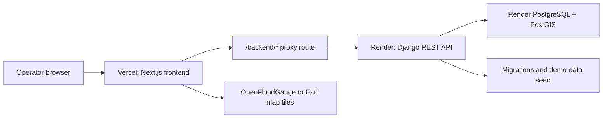
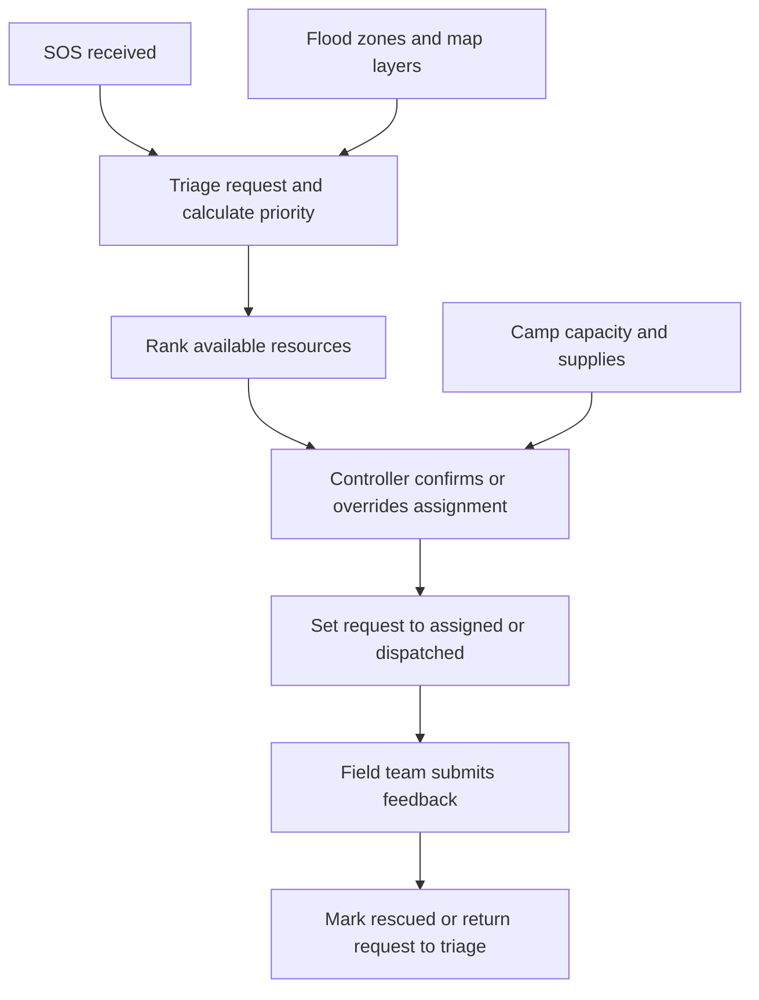
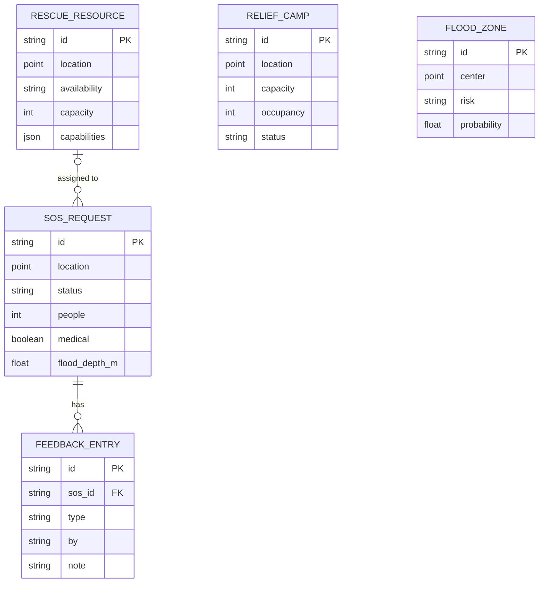

# ResQFlow

ResQFlow is a prototype command centre for coordinating flood-response work:
triaging SOS requests, locating available rescue resources, tracking relief
camps, recording field feedback, and visualising flood-risk areas.

It is a decision-support prototype. Allocation scores and camp forecasts use
deterministic, explainable rules and demo data; they are not trained predictions
or a substitute for operational authorisation.

## System architecture



The browser calls the same-origin `/backend/api/v1/*` path. A Next.js route
handler forwards that request to Django using the server-only `DJANGO_API_URL`.
If the API is unavailable, the frontend continues with typed in-memory demo
fixtures.

## Operational workflow



## Data model



All geographic fields are PostGIS points in WGS 84 (`SRID 4326`) with spatial
indexes. `SOSRequest.assigned_resource` is optional and becomes `NULL` if the
linked resource is removed. Deleting an SOS request deletes its feedback.

## Stack

| Layer               | Technology                                          |
| ------------------- | --------------------------------------------------- |
| Frontend            | Next.js App Router, React, TypeScript, Tailwind CSS |
| Client state        | React context with typed demo fallback              |
| Maps                | Leaflet with OpenFloodGauge or Esri tiles           |
| API                 | Django 5, Django REST Framework, Gunicorn           |
| Database            | PostgreSQL 17 with PostGIS 3.5                      |
| Local orchestration | Docker Compose                                      |
| Production          | Vercel frontend, Render Django API and PostgreSQL   |

## Main screens

- **Command Centre** — snapshot of requests, resources, recommendations, and
  system status.
- **Operations Map** — SOS, resource, camp, and flood-zone layers.
- **SOS Requests** — review, triage, assign, dispatch, and update requests.
- **Resources** — rescue-resource availability and capability tracking.
- **Allocation** — explainable resource ranking and controller override.
- **Relief Camps** — capacity, supply, medical-load, and demand views.
- **Field Feedback** — record field updates and change request status.
- **Analytics, Connectivity, Demo Run** — prototype analytics and offline/demo
  experiences.

## API

The Django API is rooted at `/api/v1/`.

| Endpoint                        | Purpose                                                                   |
| ------------------------------- | ------------------------------------------------------------------------- |
| `GET /api/v1/health/`           | Confirms PostgreSQL/PostGIS connectivity. Use this for uptime monitoring. |
| `GET /api/v1/bootstrap/`        | Returns the dashboard snapshot.                                           |
| `/api/v1/sos/`                  | CRUD for SOS requests.                                                    |
| `POST /api/v1/sos/{id}/assign/` | Transactionally assigns a rescue resource.                                |
| `/api/v1/resources/`            | CRUD for rescue resources.                                                |
| `/api/v1/camps/`                | CRUD for relief camps.                                                    |
| `/api/v1/flood-zones/`          | CRUD for flood zones.                                                     |
| `/api/v1/feedback/`             | CRUD for field feedback.                                                  |

The Next.js client accesses the same endpoints through
`/backend/api/v1/*`; do not expose Django database credentials to the browser.

## Run locally

### Full stack with Docker

```bash
docker compose up --build
```

- Frontend: `http://localhost:3000`
- Django API: `http://localhost:8001/api/v1/`
- Health check: `http://localhost:8001/api/v1/health/`

### Frontend development

```bash
docker compose up --build -d db backend
npm install
npm run dev
```

The frontend uses `http://127.0.0.1:8001` by default for the API proxy.

## Environment variables

### Vercel frontend

```env
DJANGO_API_URL=https://<your-render-api>.onrender.com
NEXT_PUBLIC_OPENFLOODGAUGE_TILE_URL=<optional-tile-template-or-WMTS-url>
```

`DJANGO_API_URL` is server-only. Only values prefixed with `NEXT_PUBLIC_` are
visible to browser code.

### Render Django service

```env
DJANGO_SECRET_KEY=<long-random-secret>
DJANGO_DEBUG=false
DJANGO_ALLOWED_HOSTS=<your-render-api>.onrender.com
CORS_ALLOWED_ORIGINS=https://<your-vercel-project>.vercel.app
POSTGRES_DB=<render-database-name>
POSTGRES_USER=<render-database-user>
POSTGRES_PASSWORD=<render-database-password>
POSTGRES_HOST=<render-internal-database-host>
POSTGRES_PORT=5432
```

Use the Render database's internal connection values. `DJANGO_ALLOWED_HOSTS`
uses hostnames only; `CORS_ALLOWED_ORIGINS` uses complete HTTPS origins.

## Deploy

1. Create a Render PostgreSQL service in the same region as the API.
2. Create a Render **Docker Web Service** from this repository with:

   ```text
   Root Directory: backend
   Dockerfile Path: ./Dockerfile
   Docker Build Context Directory: .
   Docker Command: leave blank
   ```

   The backend container automatically applies migrations, seeds demo data, and
   binds to Render's `PORT`.

3. Set the Render variables above and deploy. Confirm:

   ```text
   https://<your-render-api>.onrender.com/api/v1/health/
   ```

4. Import the repository into Vercel as a **Next.js** project with root
   directory `./`. Set `DJANGO_API_URL` to the Render API origin and deploy.
5. Copy the Vercel production domain into Render's `CORS_ALLOWED_ORIGINS`, then
   redeploy the Django API.
6. If using a third-party keep-alive service, send a `GET` request every ten
   minutes to the Render health URL from step 3.

## Verify

```bash
npm run typecheck
npm run lint
npm run build
docker compose run --rm backend python manage.py test
```

## Repository layout

```text
app/                 Next.js routes and backend proxy route
src/components/      Shared application and UI components
src/routes/          Screen-level client components
src/lib/aegis/       Client API, data, state, maps, and allocation logic
backend/             Django project, REST API, migrations, and seed command
compose.yaml         Local frontend, backend, and PostGIS services
Dockerfile           Frontend Docker image
backend/Dockerfile   Django Docker image
```

## Prototype limits

- Demo records are seeded automatically and frontend fallback data is available.
- Allocation, risk, and camp forecasts are deterministic heuristics.
- No authentication, role management, real-time messaging, background workers,
  external alert ingestion, or trained ML models are included.
